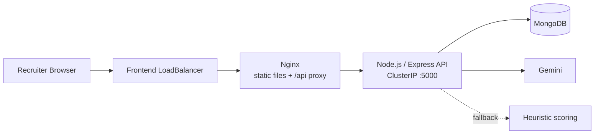
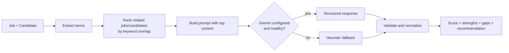
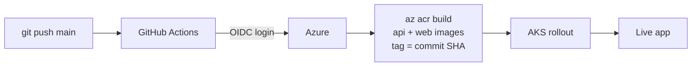

<div align="center">


# TalentMatch AI

**An AI-powered hiring workspace that tells recruiters _why_ a candidate matches, not just a percentage.**

Explainable match scores, skill-gap analysis, interview workflows, and a fully automated GitHub → ACR → AKS delivery pipeline.


[](https://youtu.be/VlWc3UWkbfY)

[Demo](#-demo-video) · [Features](#-features) · [Architecture](#-architecture) · [Quick Start](#-quick-start) · [Docker](#-docker-compose) · [Azure Deployment](#-cicd-and-azure-deployment) · [API](#-api-overview) · [Troubleshooting](#-troubleshooting)

</div>

---

## 🎬 Demo video

[](https://www.youtube.com/watch?v=VlWc3UWkbfY)

▶ **[Watch the 3.5-minute demo on YouTube](https://youtu.be/VlWc3UWkbfY)**. It covers the live AI match workflow (job + candidate → score, strengths, gaps), then the GitHub Actions → ACR → AKS deployment.

## The problem

Resume screening is slow, and a bare "78% match" doesn't help a recruiter decide anything. TalentMatch AI compares a candidate with a job and explains the **strengths**, **missing skills**, and a **recommendation**, so the recruiter knows whether to shortlist or where to focus the interview.

## ✨ Features

| | |
|---|---|
| 🎯 **AI match scoring** | Compares job requirements with candidate profiles and returns a score with an explanation. |
| 🧩 **Skill-gap analysis** | Highlights missing skills and suggests a learning plan. |
| 🔎 **Lightweight RAG** | Ranks related jobs and candidates from MongoDB by keyword overlap and adds the top context to the prompt. |
| 🛟 **Deterministic fallback** | If the model is unavailable or returns malformed output, validated heuristic scoring keeps the feature working. |
| 👥 **Role-based access** | Admin, Recruiter, and Interviewer roles. |
| 📅 **Interviews and evaluations** | Interview scheduling, evaluation reports, and benchmarks. |
| 🔐 **Secure sessions** | bcrypt password hashing and HTTP-only, MongoDB-backed sessions (no JWTs). |
| 📈 **Observability** | Prometheus-compatible `/metrics`, request logging, Helmet, CORS, and rate limiting. |
| 🚀 **Automated delivery** | Push to `main` → GitHub Actions → ACR → AKS, tagged with the commit SHA. |

> **A note on RAG:** retrieval is keyword-based over the app's own jobs and candidates. It is not (yet) a vector database or embedding search.

## 🏗 Architecture

### Runtime



Nginx proxies `/api` to the internal API service, so the browser sees a single origin and the session cookie is sent consistently.

### AI scoring flow



### Delivery pipeline



## 🧰 Tech stack

| Layer | Technology |
|---|---|
| Frontend | React 18, Vite, React Router, Nginx |
| Backend | Node.js 20+, Express, Mongoose, bcryptjs, `prom-client`, Helmet, CORS, Morgan, express-rate-limit |
| AI | Google Gemini (`gemini-2.5-flash`) with heuristic fallback |
| Data | MongoDB Atlas or Azure Cosmos DB for MongoDB |
| Infra | Docker, GitHub Actions, Azure Container Registry, Azure Kubernetes Service |

## 📁 Repository structure

```text
.
├── apps/
│   ├── api/                  # Express API (Dockerfile, .env.example)
│   └── web/                  # React + Vite frontend (Dockerfile, nginx.conf)
├── k8s/
│   ├── api.yaml              # API Deployment + ClusterIP Service
│   └── web.yaml              # Frontend Deployment + LoadBalancer Service
├── .github/workflows/
│   └── deploy-aks.yml        # CI/CD to ACR and AKS
├── docs/                     # Images used in this README
├── docker-compose.yml
├── DEPLOYMENT-NOTES.md
└── package.json
```

## 🚀 Quick start

**Prerequisites:** Node.js 20+, npm, Git, and MongoDB (local, Atlas, or Docker Desktop).

```bash
git clone https://github.com/harsh0628/talentmatchAi.git
cd talentmatchAi
npm install
cp apps/api/.env.example apps/api/.env      # Windows: Copy-Item apps\api\.env.example apps\api\.env
```

Edit `apps/api/.env`:

```env
PORT=5000
MONGODB_URI=mongodb://127.0.0.1:27017/talentmatch
CLIENT_URL=http://localhost:5173
NODE_ENV=development
SESSION_COOKIE_NAME=tm_session
SESSION_MAX_AGE_MS=604800000
SESSION_COOKIE_SECURE=false
GEMINI_API_KEY=            # optional: leave empty to use heuristic scoring
GEMINI_MODEL=gemini-2.5-flash
AI_ENABLE_HEURISTIC_FALLBACK=true
```

Run everything:

```bash
npm run dev
```

| Service | URL |
|---|---|
| Frontend | http://localhost:5173 |
| API | http://localhost:5000 |
| Health | http://localhost:5000/health |
| Metrics | http://localhost:5000/metrics |

If the root command is unavailable, run `npm run dev:api` and `npm run dev:web` separately.

## 🐳 Docker Compose

Runs MongoDB, the API, and the production frontend together.

```bash
docker compose up --build -d
curl http://localhost:5000/health
```

App: http://localhost:5173

```bash
docker compose ps                # status
docker compose logs -f api       # logs
docker compose down              # stop
docker compose down -v           # stop and remove the MongoDB demo volume
```

## 🔐 Authentication

1. The user logs in with email and password.
2. The API creates a random session ID and stores its **hash** in MongoDB.
3. The raw ID is sent as an **HTTP-only** cookie.
4. Protected requests are authorized from that cookie.
5. Logout deletes the session and clears the cookie.

Use `SESSION_COOKIE_SECURE=false` for an HTTP/IP demo and `true` behind HTTPS.

## ☁️ CI/CD and Azure deployment

A push to `main` (or a manual run) triggers `.github/workflows/deploy-aks.yml`, which:

1. Logs in to Azure with **GitHub OIDC** (no long-lived client secret).
2. Builds the API image in ACR.
3. Builds the web image in ACR with `VITE_API_URL=/api`.
4. Tags both images with the **commit SHA** (immutable, traceable releases).
5. Gets AKS credentials and ensures the API Service is internal on port `5000`.
6. Updates both Deployments and waits for the rollouts to finish.

```bash
git add .
git commit -m "Describe the change"
git push origin main
```

<details>
<summary><b>Azure resources and identities</b></summary>

| Resource | Name |
|---|---|
| Container Registry | `talentmatchacr2026` (resource group `ai-talentmatch`) |
| AKS cluster | `aks-web-demo` (resource group `myAKSResourceGroup`) |

- **GitHub Actions identity** pushes images: `AcrPush`, registry-scoped `Contributor` (for `az acr build`), and `Contributor` on the AKS resource group.
- **AKS kubelet identity** pulls images: `AcrPull`.
- The ACR is private. The frontend is a public `LoadBalancer`; the API is an internal `ClusterIP`.

Repository secrets: `AZURE_CLIENT_ID`, `AZURE_TENANT_ID`, `AZURE_SUBSCRIPTION_ID`.

Federated credential:

```text
Issuer:   https://token.actions.githubusercontent.com
Subject:  repo:harsh0628/talentmatchAi:ref:refs/heads/main
Audience: api://AzureADTokenExchange
```

</details>

<details>
<summary><b>Manual AKS deployment</b></summary>

```bash
az aks get-credentials --resource-group myAKSResourceGroup --name aks-web-demo --overwrite-existing
kubectl get nodes

az acr build --registry talentmatchacr2026 --resource-group ai-talentmatch \
  --image talentmatch-api:v2 --file apps/api/Dockerfile apps/api

az acr build --registry talentmatchacr2026 --resource-group ai-talentmatch \
  --image talentmatch-web:v2 --file apps/web/Dockerfile \
  --build-arg VITE_API_URL=/api apps/web
```

Replace the MongoDB placeholder in `k8s/api.yaml` with a real connection string (never commit it), then:

```bash
kubectl apply -f k8s/api.yaml
kubectl apply -f k8s/web.yaml
kubectl rollout status deployment/talentmatch-api
kubectl rollout status deployment/talentmatch-web
kubectl get service talentmatch-web

FRONTEND_EXTERNAL_IP=$(kubectl get service talentmatch-web -o jsonpath='{.status.loadBalancer.ingress[0].ip}')
kubectl set env deployment/talentmatch-api CLIENT_URL="http://$FRONTEND_EXTERNAL_IP" SESSION_COOKIE_SECURE=false
```

Verify the deployed commit tag:

```bash
kubectl get deployment talentmatch-api -o jsonpath='{.spec.template.spec.containers[0].image}{"\n"}'
kubectl get deployment talentmatch-web -o jsonpath='{.spec.template.spec.containers[0].image}{"\n"}'
```

Roll back:

```bash
kubectl rollout undo deployment/talentmatch-api
kubectl rollout undo deployment/talentmatch-web
```

</details>

## 📡 API overview

**Public**

```text
GET  /  /health  /api/health  /metrics
POST /api/auth/register
POST /api/auth/login
GET  /api/auth/check-email
```

**Authenticated**

```text
GET/POST/PATCH/DELETE  /api/jobs
GET/POST/PATCH/DELETE  /api/candidates
GET/POST/PATCH/DELETE  /api/interviews
GET/POST/PATCH/DELETE  /api/evaluation-reports
POST                   /api/ai/match-score
POST                   /api/ai/match-score-hybrid
POST                   /api/ai/match-score-workflow
POST                   /api/ai/skill-gap-analysis
GET/POST               /api/benchmarks
GET                    /api/auth/me
POST                   /api/auth/logout
```

Unauthenticated calls to protected routes return `401` with `{ "success": false, "message": "Login is required" }`.

## 🛠 Troubleshooting

<details>
<summary><b>401 "Login is required" on protected endpoints</b></summary>

1. The frontend must call `/api`, not a separate API IP.
2. The frontend image must contain the Nginx proxy.
3. Set `SESSION_COOKIE_SECURE=false` when using an HTTP IP.
4. Confirm login returns `Set-Cookie: tm_session` and later requests send it.
5. The API Service must be `ClusterIP` on port `5000`.

```bash
kubectl get services && kubectl get pods
kubectl logs deployment/talentmatch-api --tail=100
kubectl describe deployment talentmatch-web
```

</details>

<details>
<summary><b>GitHub Actions cannot authenticate to Azure</b></summary>

Check the OIDC federated credential; its subject must match the `main` branch exactly.

</details>

<details>
<summary><b>ACR cannot be found</b></summary>

```bash
az acr show --name talentmatchacr2026 --resource-group ai-talentmatch --output table
```

Both ACR builds in the workflow must use `--resource-group ai-talentmatch`.

</details>

## 🔒 Security notes

- Never commit `.env` files, database credentials, Gemini keys, or Kubernetes Secret values.
- Use GitHub OIDC rather than long-lived Azure secrets.
- Use HTTPS with `SESSION_COOKIE_SECURE=true` in real production.
- Prefer managed MongoDB (Atlas or Cosmos DB) over a single MongoDB pod.
- Replace the broad demo permissions with least-privilege roles before production.
- Rotate any credential that has appeared in logs, screenshots, commits, or chat.

## 🗺 Roadmap

- [ ] HTTPS ingress
- [ ] Microsoft Entra ID and Azure RBAC
- [ ] Least-privilege deployment permissions
- [ ] Managed MongoDB
- [ ] Stronger probes, resource limits, and autoscaling
- [ ] Vector-based (embedding) retrieval

## 📄 More documentation

The chronological deployment log is in [DEPLOYMENT-NOTES.md](./DEPLOYMENT-NOTES.md).

---

<div align="center">

Built by [@harsh0628](https://github.com/harsh0628). If this project helped you, consider giving it a ⭐

</div>
